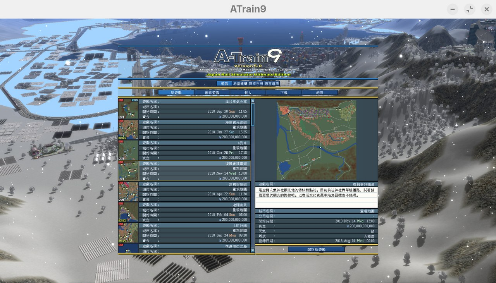
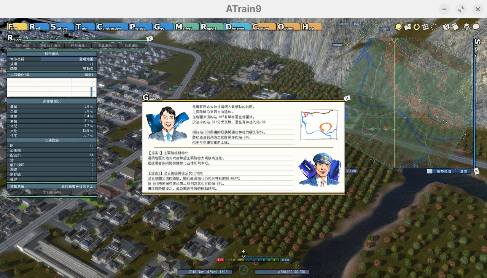
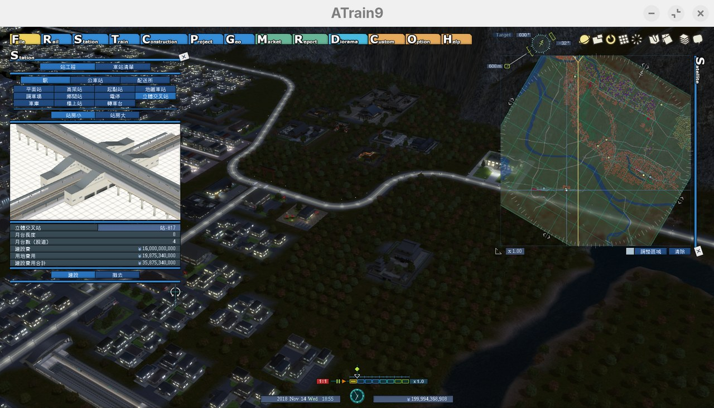
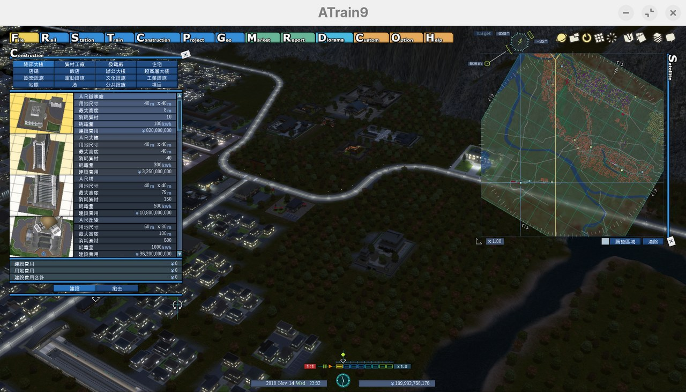
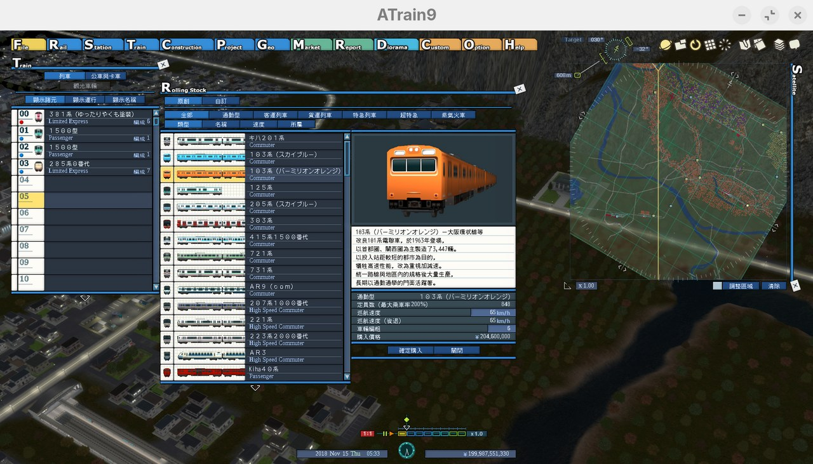
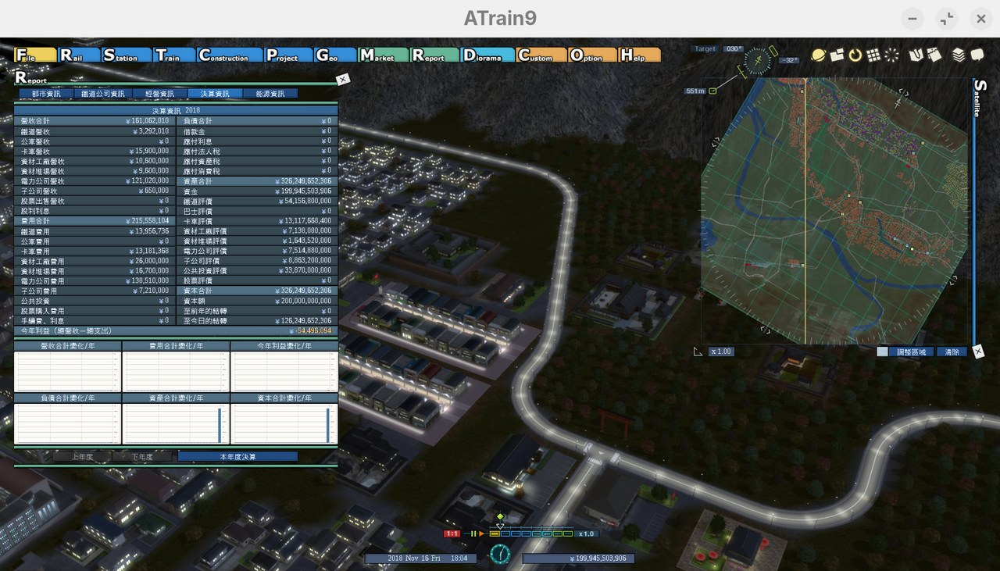

# A列車で行こう9 Version5.0 繁體中文化

把遊戲的日文介面即時顯示為台灣繁體中文。共 5,832 條對照，
**涵蓋率保守估計約九成**——選單、報表、建設項目、車輛與地圖說明大致都翻了，
少數角落可能還是日文。

**不修改任何遊戲檔案。** 安裝是複製兩個檔案，移除是刪掉它們，
Steam 的「驗證遊戲檔案完整性」會完全通過。

---

> ## ⚠ 免責聲明（使用前請務必讀完）
>
> **這是非官方的個人作品，與株式会社アートディンク（ARTDINK）、
> 發行商及任何相關企業毫無關係，未經其授權、審核或背書。**
>
> 1. **自行承擔風險。** 本軟體以「現狀」提供，不附任何明示或默示的擔保，
>    包含但不限於可用性、正確性、不侵權，以及特定用途適用性。
>    因使用本軟體而導致的任何損失——存檔毀損、遊戲無法啟動、系統異常、
>    帳號問題等——作者概不負責。**安裝前請自行備份存檔。**
> 2. **它會改寫遊戲行程的記憶體。** 這是即時翻譯的原理。雖然只改寫
>    文字內容、不動任何數值或程式邏輯，但本質上仍屬於外部程式介入，
>    理論上有造成遊戲不穩定或當機的可能。
> 3. **可能觸發防毒軟體或反作弊機制。** 代理 DLL 加上記憶體改寫是
>    啟發式偵測的典型特徵。本作僅用於單機離線遊玩，作者不建議、
>    也不對在任何線上或競賽環境中使用所產生的後果負責。
> 4. **不含任何遊戲檔案。** 本專案不散布、不包含、也不修改遊戲的
>    任何原始資料。使用者必須自行合法擁有《A列車で行こう9 Version5.0》。
> 5. **不改變遊戲內容。** 只替換顯示用的文字與字型，不修改數值、
>    平衡、存檔或解鎖任何內容，不是修改器（trainer）也不是外掛金手指。
> 6. **完全免費。** 禁止販售、禁止包裝成付費內容、禁止隨遊戲本體散布。
> 7. **翻譯內容為非官方。** 用詞與官方中文版無關，可能有誤譯或不一致。
> 8. **未經完整測試。** 只在作者的 Zorin OS 18.1 + Proton 9.0 環境實測過，
>    Windows 與 macOS 從未實機驗證。
> 9. **權利人若有異議，請開 issue 或直接聯絡，本專案會立即下架。**
>
> 繼續安裝，即表示你已閱讀並接受以上條款。

---

> ### ⚠ 測試狀態：只在作者這台 Linux 上實測過
>
> **本專案只在下列這一套環境實際跑過，其他環境完全沒有驗證。**
>
> | 項目 | 實測環境 |
> |---|---|
> | 作業系統 | Zorin OS 18.1（Ubuntu base），kernel 7.0 |
> | 執行方式 | Steam + Proton 9.0-203 |
> | 遊戲 | A列車で行こう9 Version5.0（Steam appid 3106160）|
>
> | 環境 | 狀態 |
> |---|---|
> | Linux / Proton（上述這套）| ✅ 已驗證 |
> | 其他 Linux 發行版或 Proton 版本 | ⚠ **未測試** |
> | Windows（原生）| ⚠ **完全未測試** |
> | macOS（CrossOver、Whisky）| ⚠ **完全未測試** |
>
> 技術上三個平台使用同一份 DLL，Windows 理論上更單純（不需要額外設定），
> 但**作者手上沒有 Windows 或 macOS 環境，一次都沒有實機跑過**。
> 這兩個平台的安裝說明是依照 Windows 的 DLL 載入規則推導出來的，
> 請當作未驗證的測試版看待，遇到問題請附上 log 開 issue（見下方「遇到問題時」）。
>
> 上述 Linux 環境已逐項驗證：DLL 代理轉發、檔案導向確實觸發、字型自動挑選、
> 翻譯生效（首輪改寫約 12,000 處）、遊戲資料夾所有檔案雜湊值未變。

---

## 畫面

| | |
|---|---|
|  |  |
| 地圖選擇與地圖說明 | 遊戲內導引視窗 |
|  |  |
| 車站建設面板 | 建設項目面板 |
|  |  |
| 車輛清單與車輛說明 | 決算資訊報表 |

---

## 需求

- **A列車で行こう9 Version5.0**（Steam appid 3106160）。
  V4 或更早的版本、以及 Switch／PS4 等主機版都不適用。
- 64 位元的 `ATrain9v5.exe`。
- 系統要有一套繁體中文字型。三個平台通常都內建，程式會自動挑，
  依序尋找第一個裝得到的：
  Noto Sans CJK TC → Noto Sans TC → 思源黑體 TC → 微軟正黑體 → 蘋方-繁。

---

# 安裝

## 步驟 0：備份存檔（建議）

存檔在這個資料夾，整個複製一份放到別的地方：

| 環境 | 路徑 |
|---|---|
| Windows | `%USERPROFILE%\Documents\My Games\A-Train9\save` |
| Linux（Proton）| `<Steam 資料庫>/steamapps/compatdata/3106160/pfx/drive_c/users/steamuser/Documents/My Games/A-Train9/save` |
| macOS（CrossOver）| `~/Library/Application Support/CrossOver/Bottles/<瓶子名>/drive_c/users/crossover/Documents/My Games/A-Train9/save` |

本程式不會寫入存檔，但外部程式介入遊戲時備份是基本動作。

## 步驟 1：下載

到本專案的 [Releases](../../releases) 下載壓縮檔，或直接下載這兩個檔案：

```
dinput8.dll      主程式
a9tc.txt         對照表 + 設定
```

## 步驟 2：找到遊戲資料夾

Steam 資料庫 →（在遊戲上按右鍵）→ **管理** → **瀏覽本機檔案**

會開啟一個資料夾，裡面應該看得到 `ATrain9v5.exe`。找不到的話路徑通常是：

```
<Steam 資料庫>/steamapps/common/A-Train 9 V5/
```

## 步驟 3：複製檔案

把 `dinput8.dll` 和 `a9tc.txt` 複製進去，**和 `ATrain9v5.exe` 放在同一層**。

放完長這樣：

```
A-Train 9 V5/
├── ATrain9v5.exe
├── dinput8.dll      ← 新增
├── a9tc.txt         ← 新增
└── data/
```

> ⚠ 不要放到 `data/` 或其他子資料夾，那樣不會生效。

## 步驟 4：平台設定

### Windows

**不需要任何設定**，直接開遊戲。

### Linux（Steam + Proton）

Steam 資料庫 →（右鍵遊戲）→ **內容** → **一般** → **啟動選項**，填入：

```
WINEDLLOVERRIDES="dinput8=n,b" %command%
```

這行是告訴 Wine「優先載入遊戲資料夾裡的 dinput8.dll，而不是系統內建的」。
**少了這行完全不會生效**，這是 Linux 上最常見的失敗原因。

如果啟動選項已經有別的內容（例如顯示卡設定），把上面這段加在 `%command%` 前面即可：

```
__NV_PRIME_RENDER_OFFLOAD=1 WINEDLLOVERRIDES="dinput8=n,b" %command%
```

### macOS（CrossOver / Whisky）

同樣需要設定 DLL 覆寫，兩種做法擇一：

- **CrossOver**：瓶子設定 → Wine 設定 → 程式庫 → 新增 `dinput8`，
  排序設為「原生（native）優先」
- **Whisky / 指令**：在瓶子內執行 `winecfg`，到「程式庫」分頁做同樣設定

或者在啟動指令前加上環境變數 `WINEDLLOVERRIDES="dinput8=n,b"`。

## 步驟 5：確認有生效

開遊戲，等約 20 秒（可用 `#delay=` 調整），介面文字應該變成中文。

沒變的話看 log：`%TEMP%\a9tc\a9tc.log`，對照下方「遇到問題時」。

---

## 移除

1. 刪掉遊戲資料夾裡的 `dinput8.dll` 和 `a9tc.txt`
2. Linux／macOS 把啟動選項或 DLL 覆寫設定清掉
3. 完成

遊戲資料夾沒有任何東西被改過，**不需要驗證檔案完整性，也不需要重裝**。
暫存檔在 `%TEMP%\a9tc\`，可以一併刪掉，不刪也不影響。

---

## 設定

改 `a9tc.txt` 開頭那幾行，存檔後重開遊戲生效：

| 設定 | 說明 |
|---|---|
| `#font=` | 指定字型名稱。留空 = 自動挑 |
| `#fontscale=100` | 字型大小百分比。**調太大會被固定行高裁切**，建議不超過 125 |
| `#delay=20` | 啟動後幾秒開始翻譯。電腦較慢可以調大 |
| `#patch` | 拿掉這行就只換字型、不翻譯 |

## 運作方式

程式偽裝成 `dinput8.dll`（遊戲只從它匯入一個函式），載入後原樣轉發給系統的版本，
同時做三件事：

1. 掃描遊戲行程的記憶體，把日文字串就地改寫成中文
2. 攔截字型建立，換成繁中字型並套用大小縮放
3. 攔截 `data\bmf` 底下六個字型檔的開檔，導向暫存資料夾
   （`%TEMP%\a9tc\`），在那裡放「原檔內容 + 中文字元」的版本

第 3 點是「不碰遊戲檔案」的關鍵：遊戲需要的中文字形是在暫存區補的，
原始的 `un01.bin` 等檔案只被讀取，從未被寫入。

對照表存的是原文的 64-bit FNV-1a 雜湊值，不是原文本身。程式掃到字串時
算出雜湊再查表，所以檔案裡看不到任何日文原文。

## 遇到問題時

執行紀錄在 `%TEMP%\a9tc\a9tc.log`。這個路徑可以直接貼到檔案總管的網址列，
Linux／macOS 則在遊戲 prefix 的
`drive_c/users/steamuser/AppData/Local/Temp/a9tc/` 底下。

**回報問題請附上這個檔的前 20 行**，裡面依序記錄了每個可能出錯的環節：

```
[init] a9tc 散布版啟動（不寫入任何遊戲檔案）
[init] LoadLibrary(...) → 不同模組，OK          ← 代理是否正常轉發
[cfg]  載入 5832 條對照                          ← 對照表有沒有讀到
[bmf]  un01.bin：原檔 N bytes，追加 M 個字元      ← 中文字元有沒有補進去
[hook] KERNEL32.dll!CreateFileW → OK             ← 檔案導向有沒有掛上
[bmf]  導向 ...\data\bmf\un01.bin → ...\Temp\a9tc\un01.bin   ← 導向真的有觸發
[font] 自動選用 XXX                              ← 挑到哪套字型
[patch] 熱區第 1 輪：改寫 N 處                    ← 翻譯有沒有生效
```

常見狀況：

| log 症狀 | 原因 |
|---|---|
| 完全沒有 log 檔 | DLL 沒被載入。Linux／macOS 請確認啟動選項那行有填 |
| `載入 0 條對照` | `a9tc.txt` 沒放進遊戲資料夾，或放錯層 |
| 沒有 `[bmf] 導向` 這種行 | 檔案導向沒觸發，中文可能顯示為方框 |
| `[font] 候選字型都找不到` | 系統沒有繁中字型，請自行安裝後用 `#font=` 指定 |
| 有 log 但畫面全是日文 | 看 `[patch] 第 1 輪` 的改寫數，正常應有一萬以上 |

## 已知限制

- 涵蓋率約九成。少數字串沒有翻到，多半是遊戲把長句折行後留下的片段。
- 專有名詞（日本鐵道公司、路線、車輛形式）多半保留原樣或做字形轉換，
  例如 `キハ40系` → `Kiha40系`、`東京メトロ` → `東京地鐵`。
- 譯文比原文長時會被跳過，那一條會維持日文——這是為了不越界寫壞記憶體。
- 遊戲若改版更動文字，對應的條目會失效變回日文，不會造成錯誤。
- **Windows 防毒可能誤報。** 代理 DLL 加上掃描並改寫記憶體，是啟發式偵測的
  典型特徵。原始碼（`a9tc_dist.c`）一併附上，可自行檢視或重新編譯。

## 原始碼與編譯

`src/a9tc_dist.c` 是完整原始碼，沒有其他相依。

```bash
# Debian / Ubuntu
sudo apt install gcc-mingw-w64-x86-64
./src/build.sh
```

編譯出來的 DLL 相依只有 `KERNEL32` / `msvcrt` / `GDI32` / `USER32`，
四個都是標準 Windows 元件。

`src/make-table.py` 是對照表產生器，把「原文<TAB>譯文」轉成雜湊版。

## 授權

原始碼採 MIT（見 `LICENSE`）。

`a9tc.txt` 是譯文，屬原作品的衍生內容，相關權利屬
株式会社アートディンク。僅供正版使用者自行使用，不得商業利用或
隨遊戲本體散布。

《A列車で行こう9》為株式会社アートディンク之商標／著作物，
本專案僅為指稱該遊戲而使用其名稱，不主張任何相關權利。
